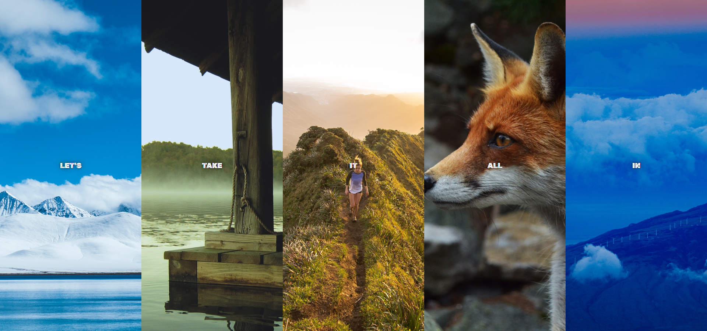

# Image Gallery || Flex Panel

## Welcome! 👋

Hello! Thanks for cheking out this repository.

## What is it about

It's a image gallery made with flexbox and vanilla JS. I've been practicing basic javascript project from [wesbos's javascript 30 course](https://courses.wesbos.com/account/access/62adf09d8ed3995269d75c5a). This is the day5 project.

This project teaches(especially) you how to:

-sizing and aligning items with flexbox.

-call function when transition ends

## Live site URL

<https://drougnov.github.io/Flex-Panel-Image-Gallery/>

## Built with

-HTML

-CSS Flexbox

-Javascript

## Author

Facebook -[Biplob Barua Rocky] <https://www.facebook.com/drougnov.bd.9>

Frontend Mentor - <https://www.facebook.com/ANT1D0t35>

### Any suggestion

I would be glad and greatful if you could leave any suggestion for this project or about anything else. Have a good day :)
